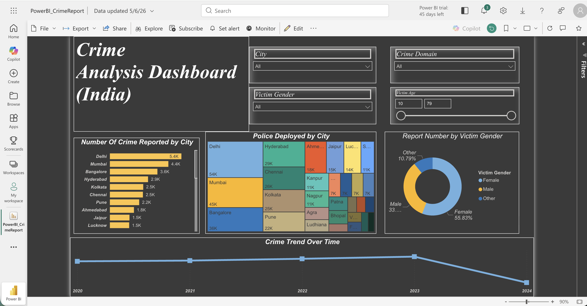
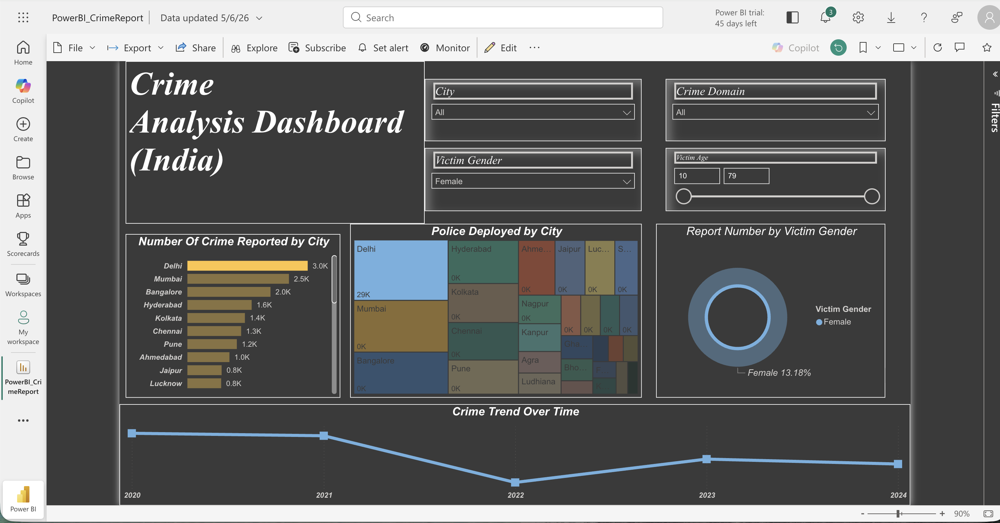

# Crime-Analysis-Dashboard-PowerBI
Interactive PowerBI Dashboard analyzing crime trends and victim demographics in India
---

## 📊 Dashboard Preview

### Main Dashboard

### Dashboard Interaction

---

## 🚀 Features
- Crime analysis by city
- Victim gender analysis
- Police deployment visualization
- Crime trend analysis over time
- Interactive slicers and filters

---

## 🛠️ Tools Used
- Power BI
- Power Query
- DAX
- Data Visualization

---

## 📂 Files Included
- PowerBI_CrimeReport.pbix
- Dashboard screenshots

---

## 📈 Insights
- Delhi and Mumbai reported the highest crime counts
- Female victims represented a major share
- Crime trends fluctuated over the years
